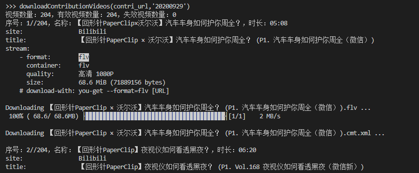
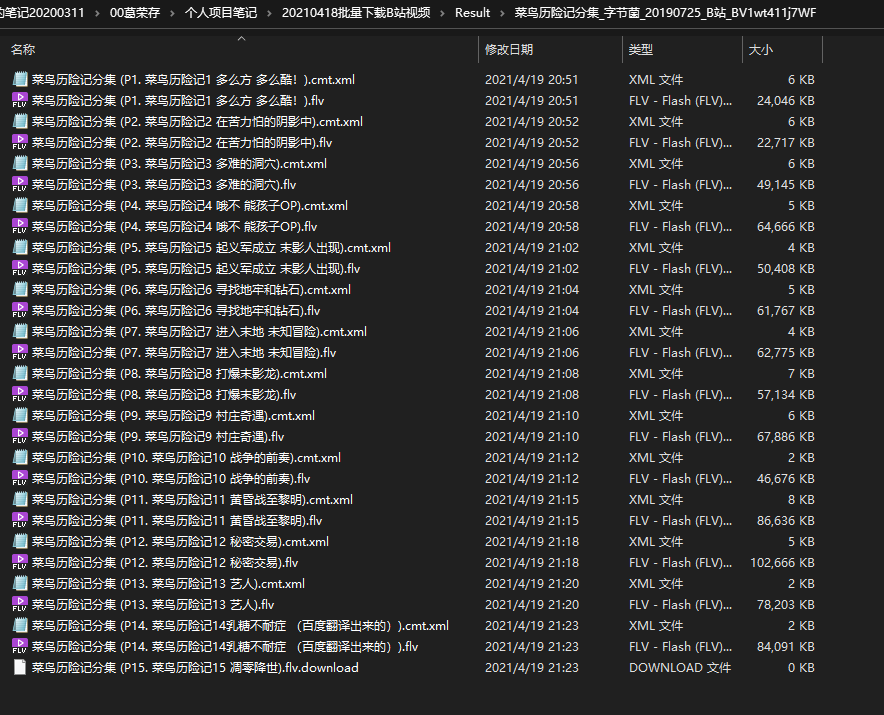

**摘要：** 使用B站API获得url，再利用you-get库批量下载B站视频。  
详细介绍：[项目 | 利用you-get库批量下载B站视频](https://www.gerongcun.xyz/blog/2021/dcdbab01/)

### 1. 项目目标

我经常刷B站，看到有意思的视频，会收藏起来。等收集到一定数量后，我会下载下来，便于日后重温。之所以下载下来，是因为担心视频可能会失效。

另外，遇到喜欢的UP主，我倾向于将UP主的投稿视频、收藏夹视频下载下来慢慢看。

综上，通过本项目，我想实现批量下载UP主投稿视频、自己收藏夹里的视频、UP主收藏夹里的视频。  
Github项目：<https://github.com/GeRongcun/BilibiliBatchDownloader>

### 2. 实现思路

[you-get](https://github.com/soimort/you-get)是一个命令行工具，它可以从Web下载媒体内容(视频、音频、图像)。

安装完you-get后，在命令行输入`you-get url`就可以下载视频。  
示例：`you-get https://www.bilibili.com/video/BV1Mb411V72k`

有了you-get，只要有视频url，就可以很方便得下载视频。那么，如何批量获得视频url呢？答案是B站API。B站提供了API，方便我们批量获得视频url。

所以，本项目的实现思路是使用B站API来获得视频url，再利用you-get下载视频。

### 3. you-get介绍

you-get，一个强大视频下载工具，是github上Python 的一个开源库，只要你能获取视频的链接地址，就能用 you-get将视频下载下来。

you-get支持下载的视频网站很多，比如B站、Youtube、爱奇艺、腾讯视频……

Github项目：<https://github.com/soimort/you-get>

因为you-get是命令行工具，所以在运行代码时，可能会出现“you-get不是内部或外部命令，也不是可运行的程序”的错误，在命令行输入`python -m pip install you-get`。

参考资料：  
['you-get' 不是内部或外部命令，也不是可运行的程序 或批处理文件](https://ask.csdn.net/questions/6076639)

### 4. 实现效果

运行中的代码：  


成果文件：  


### 5. 文件目录介绍

```
│  README.md
│  README文件
├─core
│   代码文件夹
│  │  downloadVideos.py
│  │  getVideoUrl.py
│  │  main.py
│  │  __init__.py
│  └─__pycache__
│    自动生成的编译文件
│          downloadVideos.cpython-38.pyc
│          getVideoUrl.cpython-38.pyc
├─docs
│      JSON格式化_UP主投稿视频API.txt
│        根据投稿视频API，获得的html文本
│      JSON格式化_收藏夹视频API.txt
└─     README.md
```